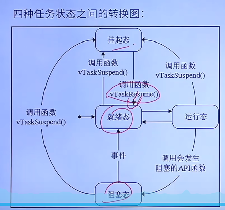
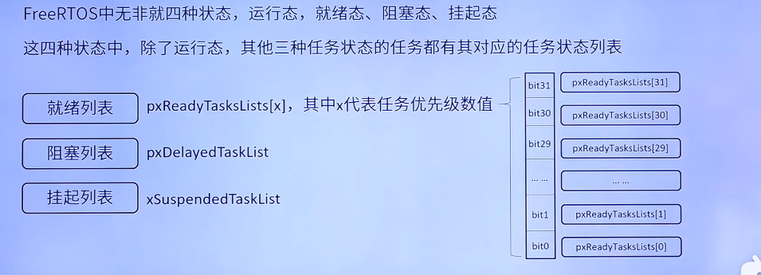
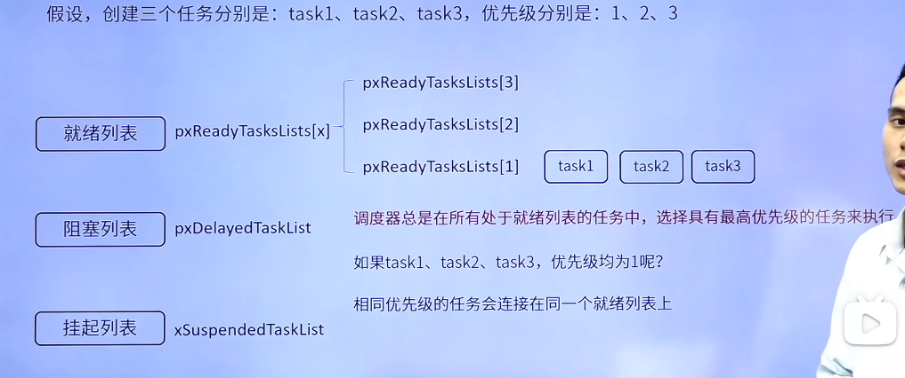

# FreeRTOS学习记录
## 基础知识
### 任务调度简介（熟悉）
调度器就是使用相关的调度算法来决定当前需要执行的哪个任务
- 三种调度方式：
  - 抢占式调度：主要针对优先级不同的任务，1.高优先级任务优先执行，2.高优先级任务不停止，低优先级任务无法执行
  - 时间片调度：主要针对优先级相同的任务，1.同等优先级任务，轮流执行；时间片流转，2.一个时间片大小，取决于滴答定时器中断周期，3.注意没有用完的时间片不会再使用，下次执行之前的阻塞任务得到执行 还是按照一个时间片的时钟节拍运行
  - 协程式调度：不做要求
### 任务状态（熟悉）
共存在四种状态：
- 运行态：正在执行的任务，注意在STM32中，同一时间仅一个任务处于运行态
- 就绪态：该任务已经能被执行，但当前还未被执行
- 阻塞态：因延时或者等待外部事件发生
- 挂起态：类似暂停，调用函数vTaskSuspend()进入挂起态，需要解挂函数vTaskResume()才可以进入就绪态
- 总结：1.仅就绪态可以变为运行态，2.其他状态的任务想运行，必须先转变为就绪态

- 任务状态列表
- 
- 任务状态列表的用法
- 