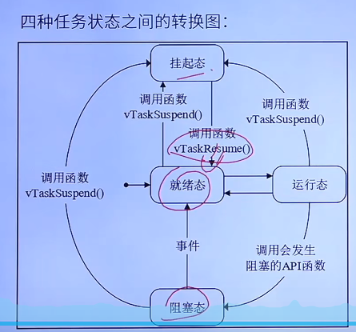
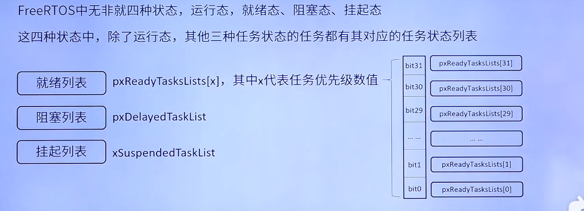
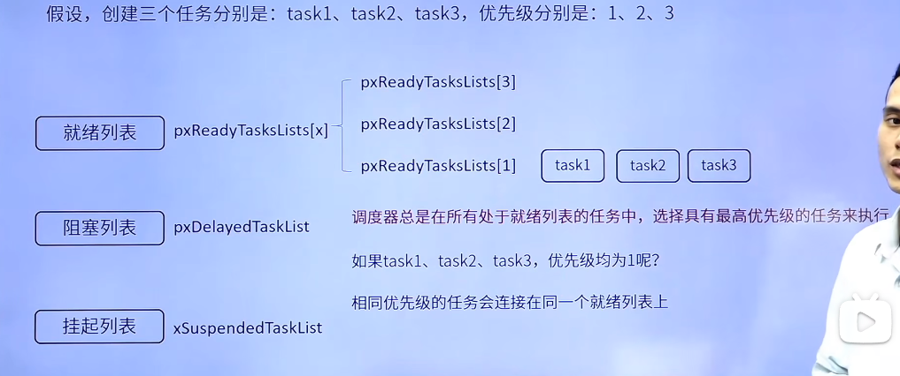
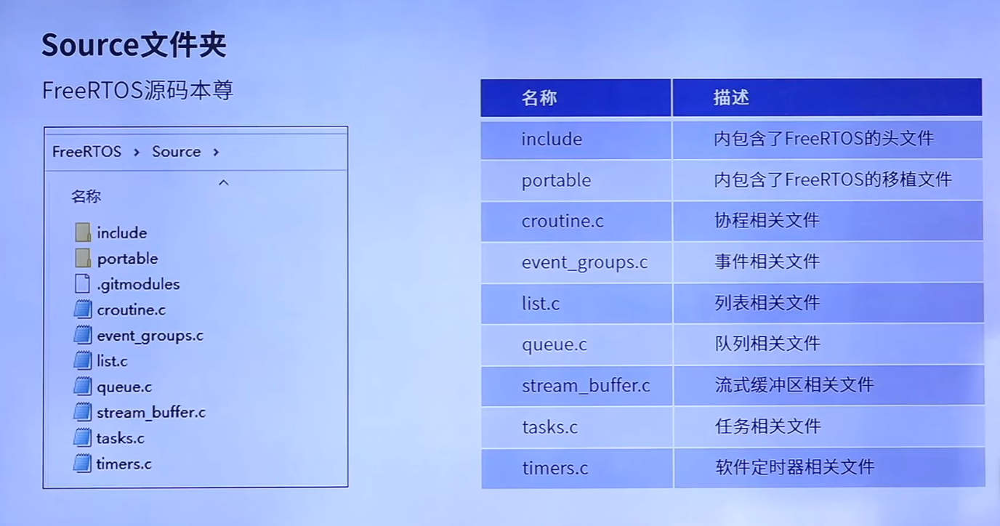
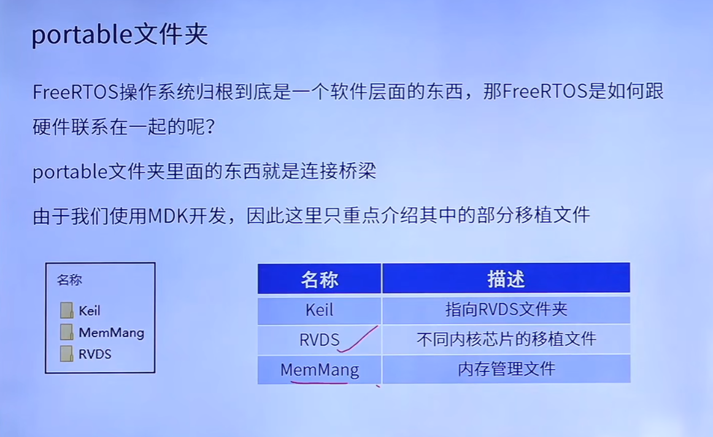
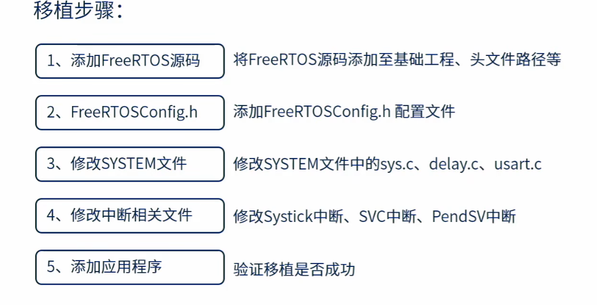
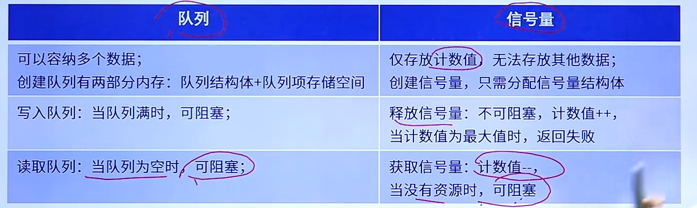

# FreeRTOS学习记录
## 基础知识
### 任务调度简介（熟悉）
调度器就是使用相关的调度算法来决定当前需要执行的哪个任务
- 三种调度方式：
  - 抢占式调度：主要针对优先级不同的任务，1.高优先级任务优先执行，2.高优先级任务不停止，低优先级任务无法执行
  - 时间片调度：主要针对优先级相同的任务，1.同等优先级任务，轮流执行；时间片流转，2.一个时间片大小，取决于滴答定时器中断周期，3.注意没有用完的时间片不会再使用，下次执行之前的阻塞任务得到执行 还是按照一个时间片的时钟节拍运行
  - 协程式调度：不做要求
### 任务状态（熟悉）
共存在四种状态：
- 运行态：正在执行的任务，注意在STM32中，同一时间仅一个任务处于运行态
- 就绪态：该任务已经能被执行，但当前还未被执行
- 阻塞态：因延时或者等待外部事件发生
- 挂起态：类似暂停，调用函数vTaskSuspend()进入挂起态，需要解挂函数vTaskResume()才可以进入就绪态
- 总结：1.仅就绪态可以变为运行态，2.其他状态的任务想运行，必须先转变为就绪态

- 任务状态列表
- 
- 任务状态列表的用法
- 
## FreeRTOS源码获取
- FreeRTOS源码本尊

- portable文件夹里面的东西就是连接桥梁，详解如下图所示：

## FreeRTOS移植步骤
- 
## FreeRTOS系统配置文件（有感性认知，浅识）
- 作用：对FreeRTOS系统进行功能配置和裁剪，以及API函数的使能
### 详解 
- 相关宏大致分为三类：
  - "INCLUDE"：配置API函数 
  - config：完成功能配置和裁剪
  - 其他配置项：PendSV、SVC宏定义
## 信号量简介
队列与信号量的对比
-
### 二值信号量

## 上下文的信息
 程序计数器 (PC): 像一个书签，记录了任务当前执行到哪一条指令。任务恢复时，CPU 会根据它从离开前的“书签”位置继续运行。

🎯 堆栈指针 (SP): 指向任务私有栈空间的当前地址。任务切换时，CPU 通过它知道该在哪里保存或恢复状态。

🧩 CPU 寄存器 (R0 到 R12, LR, xPSR 等): 这些是CPU的临时高速存储区，存放着正在处理的数据和指令。LR（链接寄存器）是子函数调用后的“归途路标”。

📋 任务控制块 (TCB): 这是系统用来管理任务的“档案卡”。除了上下文信息，它还记录了任务的优先级、状态等属性。

📦 自己的私有栈: 这是任务的专属工作台。上下文信息最终就保存在这里，它还存储着任务的局部变量和函数调用信息。

## FreeRTOS面试八股文
https://www.nowcoder.com/discuss/662413234351112192
## FreeRTOS任务间通讯机制
https://blog.csdn.net/qq_26354367/article/details/155953912

