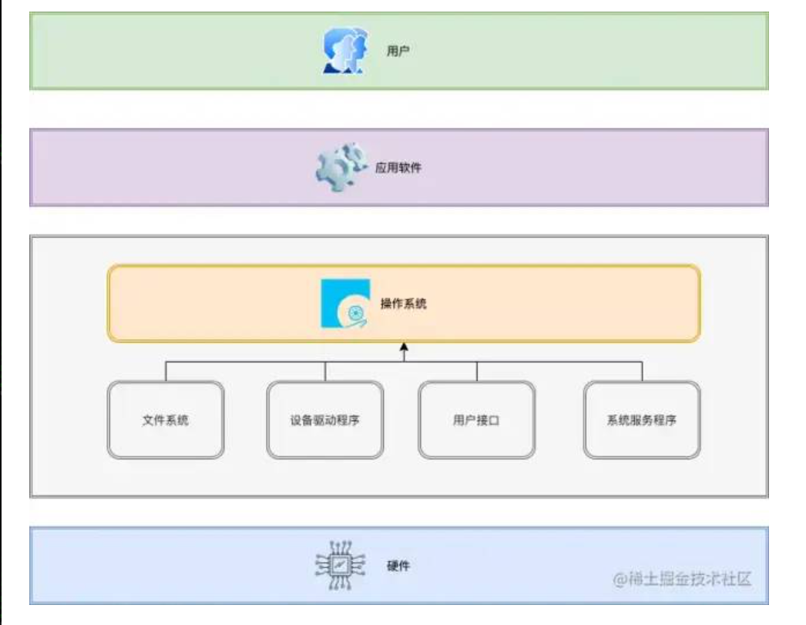
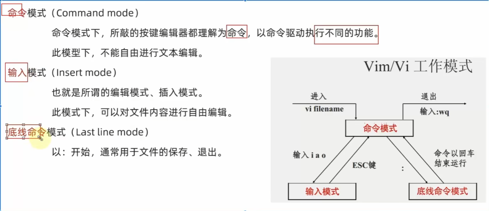
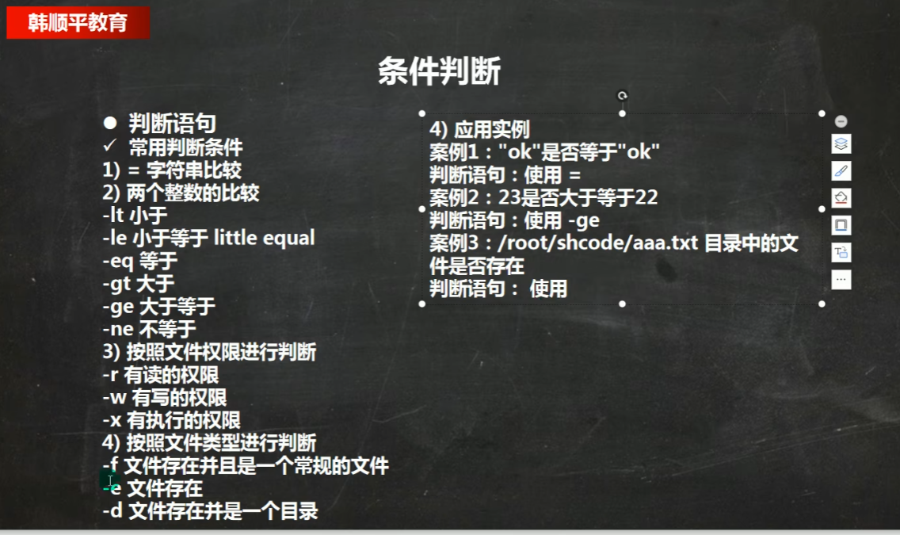

# Linux
## 操作系统
- 操作系统Operating System简称OS，是软件的一部分，它是硬件基础上的第一层软件，是硬件和其它软件沟通的桥梁。
- 操作系统会控制其他程序运行，管理系统资源，提供最基本的计算功能，如管理及配置内存、决定系统资源供需的优先次序等，同时还提供一些基本的服务程序。
- 
## 什么是Linux
-   总结:真正的 Linux指的是系统内核，而我们常说的 Linux指的是 “发行版完整的包含一些基础软件的操作系统”。
## Linux系统种类
-   红帽企业版 Linux：RHEL是全世界内使用最广泛的 Linux系统。它具有极强的性能与稳定性，是众多生成环境中使用的（收费的）系统。
-   CentOS ：通过把RHEL系统重新编译并发布给用户免费使用的 Linux系统，具有广泛的使用人群。
-   Ubuntu ：是一款派生自Debian的操作系统，对新款硬件具有极强的兼容能力。Ubuntu与Fedora都是极其出色的 Linux桌面系统，而且 Ubuntu也可用于服务器领域。
## Shell
Shell这个单词的原意是 “外壳”，跟kernel（内核）相对应，比喻内核外面的一层，即用户跟内核交互的对话界面。
- Shell是一个程序，提供一个与用户对话的环境。这个环境只有一个命令提示符，让用户从键盘输入命令，所以又称为命令行环境（command line interface，简写为CLI）。Shell 接收到用户输入的命令，将命令送入操作系统执行，并将结果返回给用户。
- Shell是一个命令解释器，解释用户输入的命令。它支持变量、条件判断、循环操作等语法，所以用户可以用Shell命令写出各种小程序，又称为Shell脚本。这些脚本都通过Shell的解释执行，而不通过编译。
- Shell是一个工具箱，提供了各种小工具，供用户方便地使用操作系统的功能。
## 命令
- 命令行提示符
    ```
    [root@iZm5e8dsxce9ufaic7hi3uZ ~]# pwd  
    /root  
    ```
    命令解析:
    - root：表示用户名；
    - iZm5e8dsxce9ufaic7hi3uZ：表示主机名；
    - ~：表示用户的家目录；
    - #：表示当前用户的权限级别，超级用户用#表示，普通用户用$表示；
- 命令格式
    ```
    command parameters（命令 参数） 
    ``` 
- 常用指令
  - pwd:    显示当前目录的路径
  - ls: 列出文件和目录，它是Linux最常用的命令之一。
    - 【常用参数】
        - a显示所有文件和目录包括隐藏的
        - -l显示详细列表
        - -h显示大小
  - cd：是英语 change directory的缩写，表示切换目录。
    ```
    cd / --> 跳转到根目录  
    cd ~ --> 跳转到家目录  
    cd .. --> 跳转到上级目录  
    cd ./home --> 跳转到当前目录的home目录下  
    cd /home/lion --> 跳转到根目录下的home目录下的lion目录  
    cd --> 不添加任何参数，也是回到家目录  
    ```
  - mkdir：创建目录(文件夹)
    ```
    mkdir directory_name --> 创建一个名为directory_name的目录
    mkdir -p directory/subdirectory --> 创建一个名为directory的目录，并在其下创建一个名为subdirectory的目录
    ```
  - touch：创建文件
  - cat ：查看文件内容
  - more：分页查看文件内容
    - 按空格键翻页
    - 按q键退出
  - rm：删除文件或目录
    ```
    rm file_name --> 删除一个名为file_name的文件
    rm -r directory_name --> 删除一个名为directory_name的目录及其内容
    ```
  - cp：复制文件或目录
    ```
    cp file_name new_file_name --> 复制一个名为file_name的文件，并重命名为new_file_name
    cp -r directory_name new_directory_name --> 复制一个名为directory_name的目录及其内容，并重命名为new_directory_name
    ```
  - mv：移动文件或目录
    ```
    mv file_name new_file_name --> 移动一个名为file_name的文件，并重命名为new_file_name
    mv directory_name new_directory_name --> 移动一个名为directory_name的目录及其内容，并重命名为new_directory_name
    如果new_file_name/new_directory_name不存在，则进行改名
    ```
  - which: 查找命令的程序文件
  - find: 查找文件
    ```
    按文件名查找：find 起始路径 -name "被查找文件名" --> 在整个系统中查找名为文件名的文件，支持通配符。
    
    按文件大小查找：find 起始路径 -size +|- n[KMG]
    例如：
    find / -size +10M --> 查找系统中大于10M的文件
    ```
  - grep: 从文件中通过关键字过滤文件行
    - 语法：grep [-n] "关键字" 文件名
    - 选项-n，可选，表示在结果中显示匹配的行号。
    ```
    grep "thing" file_name
    grep -n "thing" file_name
    ```
  - wc：统计文件行数、字数、字节数
    - 语法：wc [-c -m -l -w] 文件路径
    - -c字节数、-m字数、-l行数 -w单词数
  - 管道符：管道符|用在命令行中，表示将前一个命令的输出作为后一个命令的输入。
  ```
  cat file1.txt | grep -n "thing" 
  ```
  - echo：输出信息到屏幕或文件
  - `：被包围的内容，会被作为命令执行，而非普通字符。
  - 重定向符：
      - “>“ ：将命令的输出重定向到一个文件，覆盖原有文件内容。
      - “>>” ：将命令的输出重定向到一个文件，追加到原有文件内容。
  - tail： 查看文件尾部内容
    - 语法：tail [-f -num] Linux文件路径
    - -f ：动态显示文件内容，即文件内容更新时，自动显示最新内容。
- vi/vim：Linux系统中最常用的文本编辑器，功能强大，操作简单。
  - 
- root用户：Linux系统的超级管理员用户
- su：可以切换用户
  - 语法：su [-] 用户名
- sudo：以超级用户权限执行命令
  - 可以让一条普通命令带有root权限，语法：sudo 其他命令
  - 需要以root用户执行visudo命令，增加配方让普通用户有sudo命令的执行权限。
- Linux用户管理模式
  - Linux可以支持多用户、多用户组、用户加入多个组
  - Linux权限管控的单元是用户级别和用户组级别
-  用户、用户组相关管理命令
   -  groupadd： 添加用户组,groupdel:删除组
   -  useradd：添加用户
      - useradd [-g -d] 用户名
      - -g 指定用户组,不指定用户组，则会创建同名组并自动加入
      - -d 指定用户HOME路径，不指定，HOME路径默认为/home/用户名
      ```
      useradd test2 -g test -d /home/test2
      ```
   -  userdel：删除用户
      -   userdel [-r] 用户名
      -   不使用-r，删除用户时，HOME目录保留
   - id：查看用户信息
     - id [用户名]
   - usermod： 修改用户所属组
     -   usermod [-aG] 用户组 用户名
   - getent passwd：查看系统全部用户信息
   - getent group：查看系统全部组信息
-  chmod：修改文件、文件夹的权限细节
   -  限制：只能是文件、文件夹的所属用户或root有权修改
   -  语法：chmod [-R] 权限 文件或文件夹 （-R表示对文件夹内的全部内内容应用同样的规则）
   -  权限的数字序号：r代表4，w代表2，x代表1
      ```
      chmod -R u=rwx,g=rwx,o=rx test
      其中u：表示user所属用户权限，g表示group组权限，o表示other其他用户权限
      chmod -R 776 test
      ```
-  chown：修改文件、文件夹的所属用户、组
   -  限制：只可root执行
   -  语法：chown [-R] [用户][:][用户组]  文件或文件夹 （-R表示对文件夹内的全部内内容应用同样的规则）
      ```
      chown -R root:itheima hello.txt/test
      ```
-  各类小技巧快捷键:
  
-  软件安装：
   -  在centos中，使用yum命令联网管理软件安装
      -  语法：yum [-y] [install|remove|search] 软件名称
   -  在ubuntu中，使用apt命令联网管理软件安装
      -   语法：apt [-y] [install|remove|search] 软件名称
-   systemctl：控制软件（服务）的启动、关机、开机自启动
    -   语法：systemctl start|stop|status|enable|disable 服务名
- 软连接：
  - 可以将文件、文件夹链接到其他位置
  - 链接只是一个指向，并不是物理移动，类似Windows的快捷方式
  - 语法：ln -s 操作1 操作2
    - -s 创建软链接
    - 操作1：被链接的文件或文件夹
    - 操作2：要链接去的目的地
 - ping：测试到某服务器是否可联通
   -  语法：ping [-c num] 服务器IP地址/主机名 （-c，num为测试的次数）
 - wget：网络文件下载
   -  语法：wget [-b] url （后台下载）
 -  curl：发起网络请求
    -  语法：curl [-o] url （-o 用于下载使用） 
### 压缩和解压类
  - gzip/gunzip：压缩/解压文件
    - 基本语法：
      ```
      gzip 文件 (只能将文件压缩为*.gz格式)
      gunzip 文件.gz （解压缩文件命令）
      ```
  - zip/unzip：压缩/解压文件
    - 基本语法：
      ```
      zip -r myhome.zip /home/ [将home目录及其包含的文件和子文件夹都压缩]
      unzip -d /opt/tmp /home/myhome.zip [将myhome.zip解压到/opt/tmp目录下]
      ```
  - tar指令
    - 介绍：tar指令是打包指令，最后打包后的文件是.tar.gz文件。
    - 基本语法：
      ```
      tar -zcvf pc.tar.gz /home/pig.txt /home/dog.txt [将/home/pig.txt和/home/dog.txt打包成pc.tar.gz文件]
      tar -zcvf myhome.tar.gz /home/ [将/home目录及其包含的文件和子文件夹都打包成myhome.tar.gz文件]
      tar -zxvf pc.tar.gz [解压pc.tar.gz文件到当前目录]
      tar -zxvf /home/myhome.tar.gz -C /opt/tmp [将myhome.tar.gz解压到/opt/tmp目录下]
      ```
## Shell脚本
### 脚本
  - 脚本格式要求：
    - 脚本以#!/bin/bash开头，表示脚本使用bash解释器执行
    - 脚本需要有可执行权限
  - 编写第一个Shell脚本
    - 创建hello.sh文件，并添加以下内容
      ```
      #!/bin/bash
      echo "Hello World"
      ``` 
  - 脚本常用的执行方式
    - 1：赋予脚本的+x权限，输入脚本的绝对路径或相对路径
    - 2：sh  脚本名，比如 sh hello.sh
### shell变量
 - 定义规则 
   - 变量名称可以由字母、数字和下划线组成，但不能以数字开头
   - 等号两侧不能有空格
   - 变量名称一般习惯为大写
 - 将命令的返回子赋值给变量
   - A=`data`
   - A=$(data)
### 设置环境变量
  - 步骤：
    - 修改配置文件：vim /etc/profile
    - 在文件末尾添加环境变量，如：
      ```
      export PATH=/usr/local/bin
      ```
    - 使得修改立即生效：source /etc/profile
    - 在另一个shell程序中使用PATH
### 位置参数变量
  - 介绍：
    - 执行脚本后，可以获取到命令行的参数信息
  - 基本语法：
    - $n：n为数字，$0代表命令本身，$1代表第一个参数，$2代表第二个参数，以此类推
    - $#：代表参数个数
    - $*：代表所有参数，以空格分隔
    - $ @：代表所有参数，以"$IFS"分隔，默认为空格
  - pos_var.sh脚本示例：
    ```
    #!/bin/bash
    echo "0=$0,1=$1,2=$2"
    echo "参数个数=$#"
    echo "所有参数=$*"
    echo "所有参数=$@"
    ```
  - 执行pos_var.sh脚本：./pos_var.sh 10 20
  - 输出结果：
    ```
    0=./pos_var.sh,1=10,2=20
    参数个数=2
    所有参数=10 20
    所有参数=10 20
    ```
### 运算符
  - 介绍
    - 学习如何在shell中进行各种运算操作
  - 基本语法：
    - $[运算式]
    - $((运算式))
    - expr 运算式
      ```
      $[(1+2)*3]
      ```
### 条件判断
  - 基本语法
    - [ 逻辑式 ] （注意前后空格）
    - 详细用法
    ```
    if [ "ok" = "ok" ]
    if [ 1 -eq 1 ]
    if [ -f 目录 ]
    ```
    
### 第一个脚本示例
  - 脚本要求：
    - 将/home/zxf/shcode目录下的所有文件压缩成tar.gz文件，以当前日期为文件名。
    - 将压缩后的文件存放在/home/zxf/data目录的以当前日期为目录名的子目录中。
  - 脚本内容：
    ```
    #!/bin/bash
    
    ```