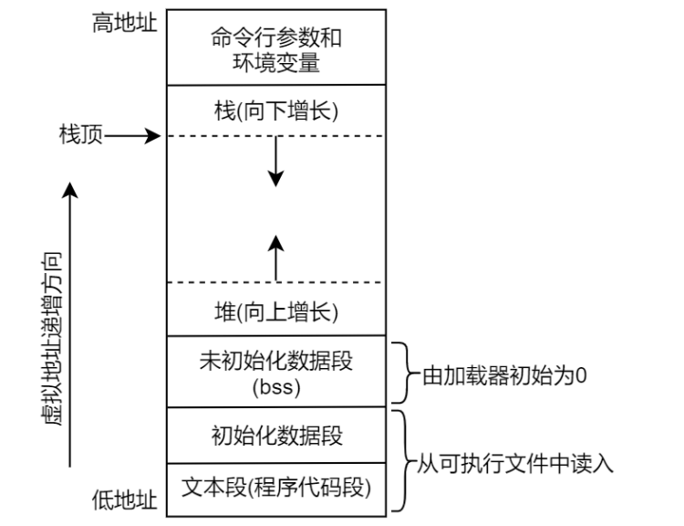
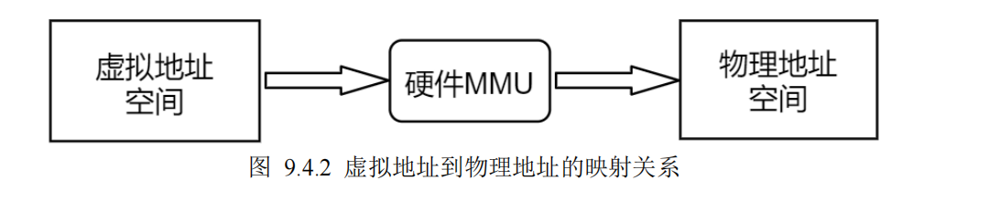

# Linux应用
分为四个模块
## 模块一：C/C++ 语言基础
- 指针与内存管理
## 模块二：Linux 系统编程
这是嵌入式Linux应用开发面试的核心模块，考察对操作系统接口的理解。
### 进程与线程
#### 进程
- 当应用程序被加载到内存中运行之后它就称为了一个进程，当程序运行结束后也就意味着进程终止，这就是进程的一个生命周期。
- Linux 系统下的每一个进程都有一个进程号（processID，简称 PID），进程号是一个正数，用于唯一标。
识系统中的某一个进程。
- 进程的内存布局

- 进程的虚拟地址空间：
    - 虚拟地址会通过硬件 MMU（内存管理
单元）映射到实际的物理地址空间中，建立虚拟地址到物理地址的映射关系后，对虚拟地址的读写操作实际

    - 进程与进程、进程与内核相互隔离。一个进程不能读取或修改另一个进程或内核的内存数据，这是因为每一个进程的虚拟地址空间映射到了不同的物理地址空间。提高了系统的安全性与稳定性。
- fork()创建子进程：子进程被创建出来之后，便是一个独立的进程，拥有自己独立的进程空间，系统内唯一的进程号，拥有自己独立的 PCB（进程控制块），子进程会被内核同等调度执行，参与到系统的进程调度中。
- vfork()与 fork()一样都创建了子进程，但 vfork()函数并不会将父进程的地址空间完全复制到子进程
中
- 进程的诞生与终止
	- 诞生：init进程是Linux系统启动之后运行的第一个进程，init进程是由内核启动的，之后可调用fork/vfork创建子进程
	- 终止：子进程使用_exit()退出、而父进程则使用 exit()退出
- wait()函数的作用除了获取子进程的终止状态信息之外，更重要的一点，就是回收子
进程的一些资源，俗称为子进程“收尸”,
- waitpid()函数等待某个特定的子进程的完成。
- 孤儿进程：父进程先于子进程结束，在 Linux 系统当中，所有的孤儿进程都自动成为 init 进程（进程号为 1）的子进程
- 僵尸进程：如果父进程创建了某一子进程，子进程已经结束，而父进程还在正常运行，但父进程并未调用 wait()回收子进程，此时子进程变成一个僵尸进程，在我们的一个程序设计中，一定要监视子进程的状态变化，如果子进程终止了，要调用 wait()将其回收，避
免僵尸进程。
#### 进程和线程的区别:
- 首先从资源来说，进程是资源分配的基本单位，但是线程不拥有资源，线程可以访问隶属进程的资源。
  
### 进程间通信（IPC）
### 同步与并发
- 同步机制：互斥锁、读写锁、条件变量、信号量的作用与区别
- 死锁：
### 文件I/O
## 模块三：网络编程
### 基础协议
### Socket编程
## 模块四：嵌入式系统与工程能力
### 系统启动与构建
- 嵌入式Linux启动流程：从Bootloader、内核、根文件系统到init进程
- 交叉编译
### 调试与问题定位
### 工程构建
- Makefile/CMake