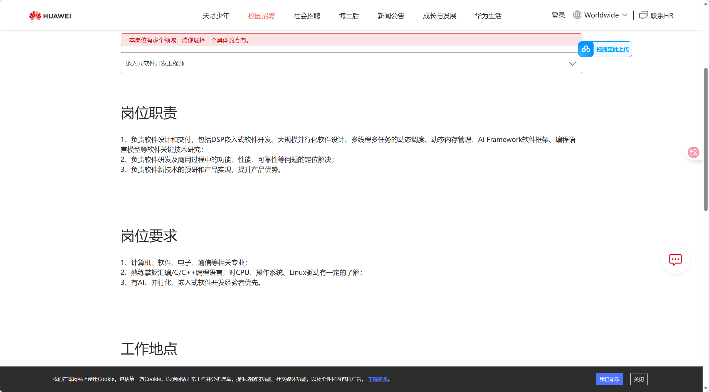

## 在官网上获取的岗位要求

## 技术要求
- 熟练掌握汇编/C/C++编程语言
- 对CPU、操作系统、Linux驱动有一定的了解
- 具备AI、并行化、嵌入式软件开发经验
## 行动
- 学习上述提到的技术点
- 参加华为举办的嵌赛（采用自己学习到的嵌入式涵盖的技术点设计作品），获得实习机会
- 大三暑假争取实习的机会
## 定期做学习总结
### 第一篇：语言类
- 熟练掌握C语言的指针与内存管理
### 第二篇 ：基础四大件（比语言要重要的多）
#### 熟练掌握数据结构和算法、计算机网络、操作系统、设计模式。
- 学习数据结构和算法，做LeetCode的习题
- 学习计算机网络，了解TCP/IP协议栈的原理
- 操作系统
- 设计模式
### 第三篇：linux操作系统
- 常见的命令、指令
- linux环境编译
- shell编程
- makefile文件