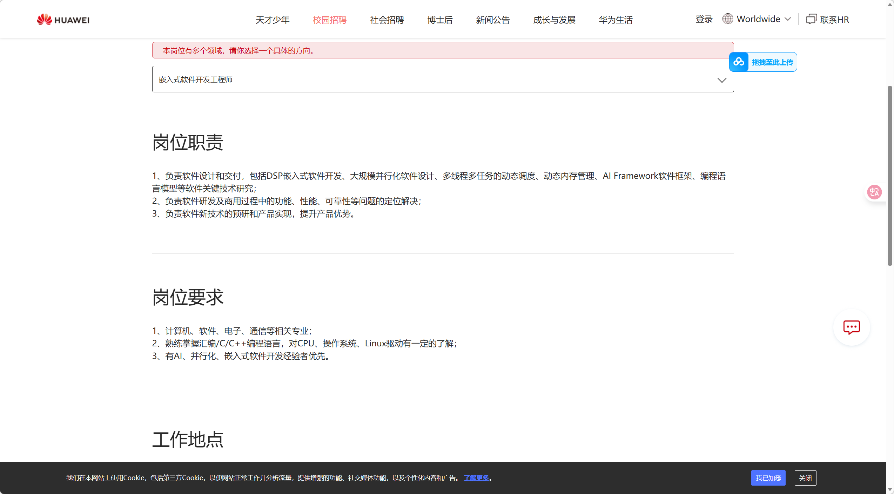
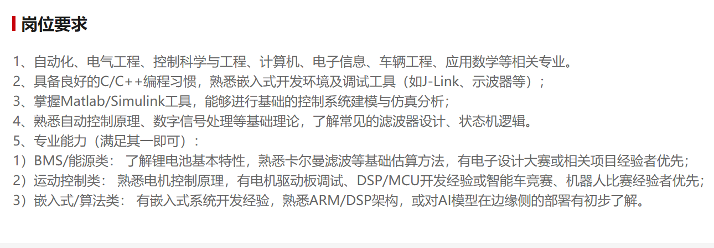
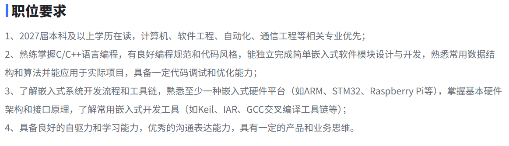
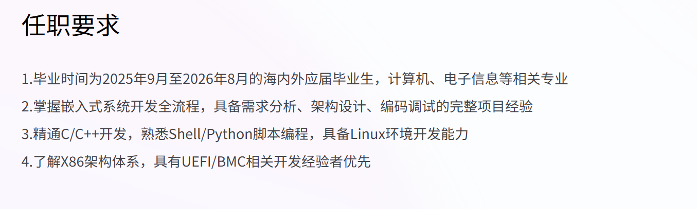

## 在官网上获取的岗位要求

## 技术要求
- 熟练掌握汇编/C/C++编程语言
- 对CPU、操作系统、Linux驱动有一定的了解
- 具备AI、并行化、嵌入式软件开发经验
## 行动
- 学习上述提到的技术点
- 参加华为举办的嵌赛（采用自己学习到的嵌入式涵盖的技术点设计作品），获得实习机会
- 大三暑假争取实习的机会
## 定期做学习总结
### 第一篇：语言类
- 熟练掌握C语言的指针与内存管理
### 第二篇 ：基础四大件（比语言要重要的多）
#### 熟练掌握数据结构和算法、计算机网络、操作系统、设计模式。
- 学习数据结构和算法，做LeetCode的习题
- 学习计算机网络，了解TCP/IP协议栈的原理
- 操作系统
- 设计模式
### 第三篇：linux操作系统
- 常见的命令、指令
- linux环境编译
- shell编程
- makefile文件

## 实践篇
主要方向：将理论知识应用到实际中，进一步巩固之前已经学习过的理论知识，并增加调试经验。
- 将freertos操作系统移植到stm32上，控制rm机器人。
- 应用龙芯久久派开发板进行嵌入式软件开发，进一步学习linux内核，了解多种外设的驱动程序。

## 华为
### 嵌入式软件
- 1、计算机科学与技术、电子科学与技术、信息与通信工程、数学、人工智能等相关专业；
- 2、熟练掌握C/C++编程语言，对CPU、Linux有一定的了解；
- 3、具备较强的学习能力、逻辑思维和问题排查能力，工作认真负责，有良好的沟通协调能力和团队协作意识； - 4、优选条件：
      - 1）熟悉CPU体系结构，有驱动、操作系统等软件开发经验；
      - 2）在校期间积极参加软件编程大赛、开源社区活动，并获得奖项和荣誉；
      - 3）熟悉使用AI工具，有AI辅助软件开发实践经验。

- 算法工程师-控制算法

## 字节
- 嵌入式开发实习生-移动OS

## 联想
- 嵌入式开发工程师

