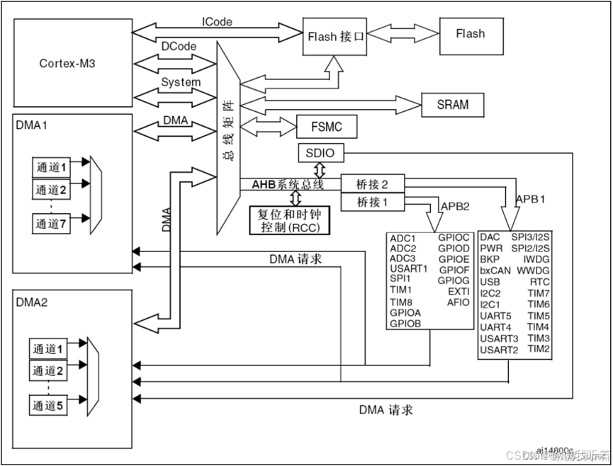

# ARM
提供CPU核心/架构 IP
### MCU
MCU(Micro Control Unit)，叫微控制器，是指随着大规模集成电路的出现及其发展，将计算机的 CPU、RAM、ROM、定时计数器和多种I/O接口集成在一片芯片上，形成芯片级的芯片。
### SRAM 与 FLASH
- SRAM 是单片机的“工作内存”，掉电丢失，但读写速度快，可任意字节访问。
  - 存放运行变量、栈 Stack、 堆 Heap、DMA 缓冲区等
- Flash 在单片机中主要相当于“程序存储器 + 常量仓库”
  -  存放程序代码、存放中断向量表、存放只读常量、存放.data段的初值副本等
### 保存、恢复现场的详细操作：
首先是中断或异常产生，CPU去FLASH里面找对应的异常向量表，异常向量表找到对应的中断函数，执行中断函数前，要进行保护现场的操作，中断函数结束后，恢复现场。
### 启动流程
单片机上电后一直到准备好C语言运行环境并跳转到main函数执行总共经历了5个步骤：
- 硬件复位与内核初始化
  - Cortex-M内核根据BOOT引脚的状态，将Flash起始地址映射为启动地址
  - 内核从该地址的中断向量表中取出第一个字（4字节），赋值主栈指针，为C语言运行分配栈空间
- 强制PC指针指向中断向量表的复位中断向量执行复位中断函数
- 在复位中断函数中调用 SystemInit 函数，初始化时钟，配置中断向量表等
- 调用 __main 函数完成全局/静态变量/常量的初始化和重定位工作，初始化堆栈和库函数（C语言运行环境初始化）
- 跳转到main函数中执行
### ARM内核架构

#### DMA总线
（Direct Memory Access）即直接存储器访问。主要用来传输数据，这个数据可以是某个外设的数据寄存存器，可以在SRAM，可以在内部的FLASH。