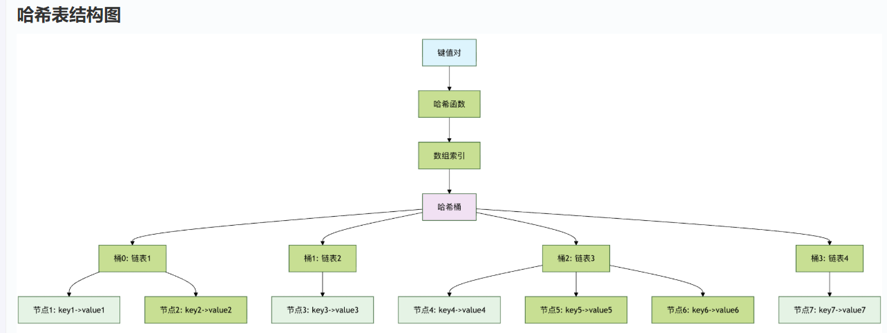
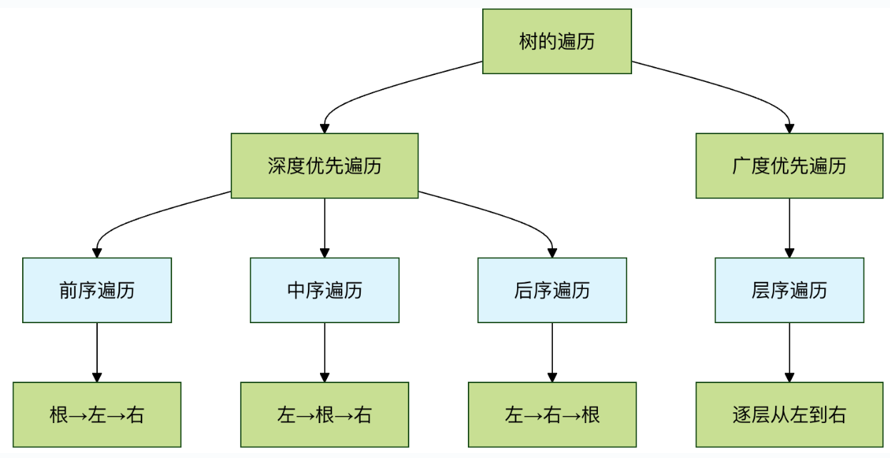
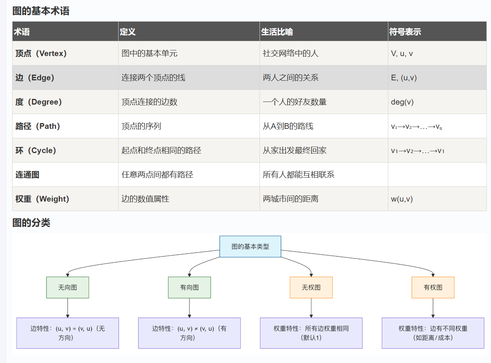
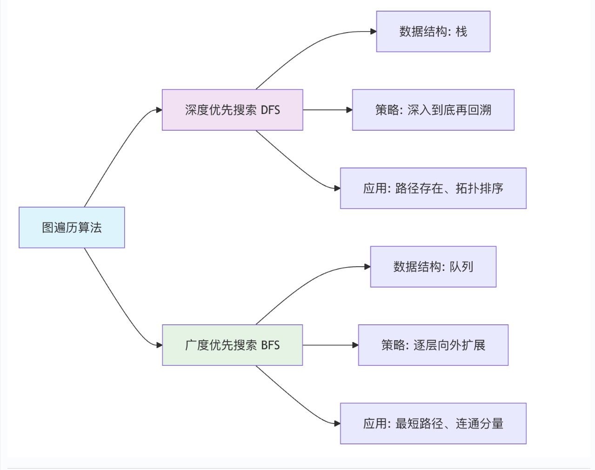
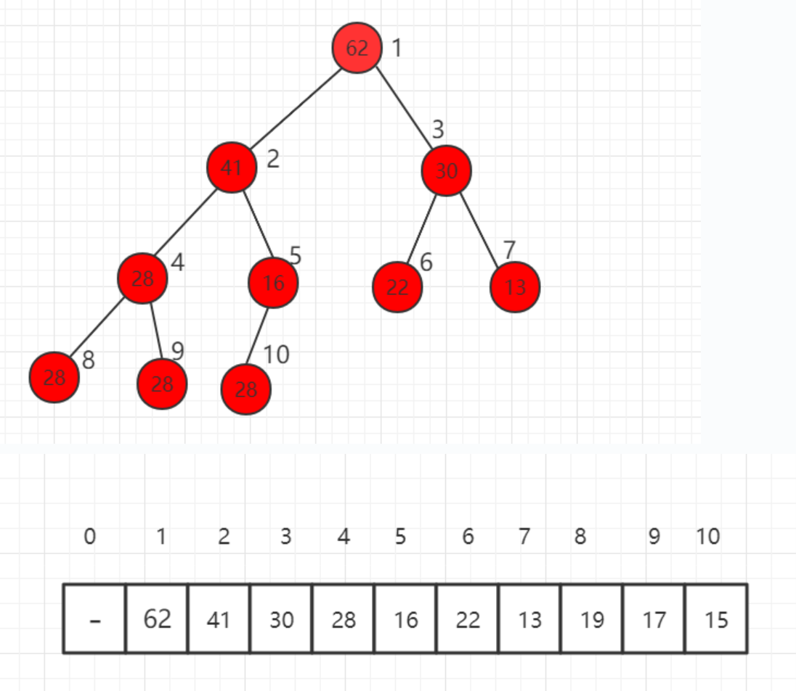
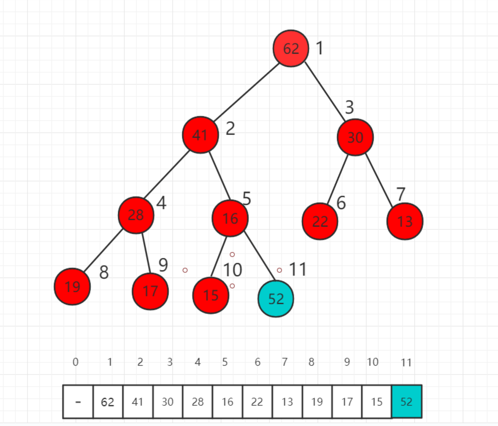
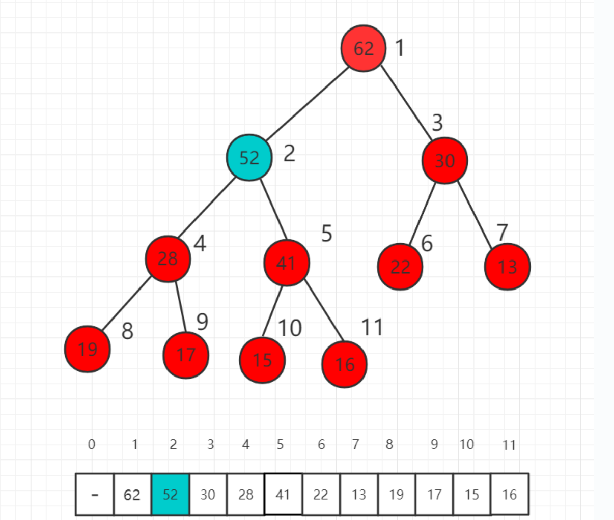
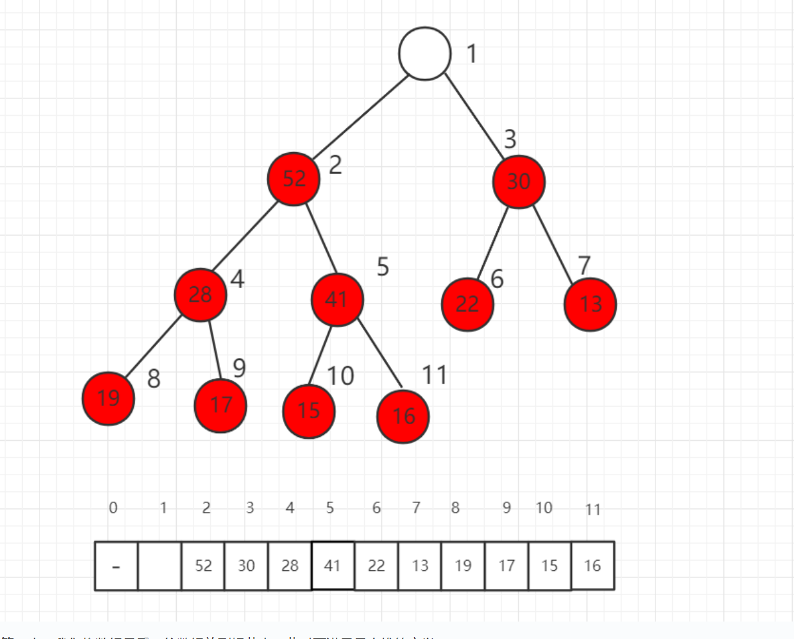
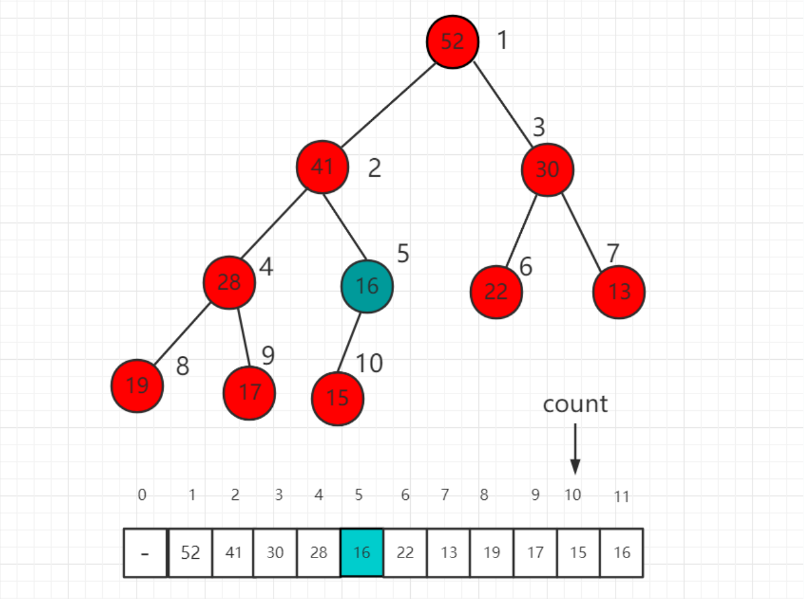

## 线性数据结构篇
- 数组
    - 基本概念与特点：连续存储、固定大小、索引访问
- 链表
    - 基本概念：链表的每个节点至少包含两部分：数据域：存储实际的数据值。指针域：存储下一个节点在内存中的地址。
    - 类型：单向链表：节点只指向下一个节点。双向链表：节点同时指向前一个和后一个节点，可以双向遍历。循环链表：尾节点指向头节点，形成一个环。
- 栈
    - 栈只允许在一端（称为 栈顶）进行插入（入栈）和删除（出栈）操作。另一端称为 栈底
    - 后进先出
- 队列
    - 队列允许在一端（称为 队尾）进行插入（入队）操作，在另一端（称为 队头）进行删除（出队）操作。
    - 先进先出
## 哈希表篇
- 什么是哈希表
    - 哈希表是一种通过键（Key）来直接访问值（Value）的数据结构，它利用一个叫做哈希函数的魔法公式，把任意大小的键（比如一个字符串、一个数字或一个对象）转换成一个固定大小的数字，这个数字被称为哈希值或哈希码。然后，用这个哈希值作为数组的索引，将值存储在这个索引对应的数组位置上。
- 核心组件
    - 键（Key）： 你要存储和查找数据时使用的标识符。比如，在电话簿中，人名就是键。
    - 值（Value）： 与键相关联的实际数据。在电话簿中，电话号码就是值。
    - 哈希函数（Hash Function）： 将键映射到数组索引的数学函数。它是哈希表的心脏。 
- 哈希冲突与解决方法（哈希冲突是指两个或更多不同的键，经过哈希函数计算后，得到了相同的数组索引。）
    -  链地址法: 它不把数据直接放在数组的每个位置，而是在每个数组位置存放一个链表（或其他数据结构，如红黑树）。当发生冲突时，新的键值对就被添加到这个位置的链表中。
    - 
    - 
## 树
树（Tree）是一种非线性的数据结构，它模拟了自然界中树的分支层次，与数组、链表这种一个接一个的线性结构不同，树中的数据元素（称为节点）之间存在明确的一对多的层次关系。
- 二叉树
  - 二叉树（Binary Tree）是每个节点最多有两个子节点的树，这两个子节点通常被称为左子节点和右子节点，它是许多强大树结构（如二叉搜索树、堆、AVL 树）的基础
  - 二叉树的遍历：前序遍历（Pre-order）：根 -> 左 -> 右；中序遍历（In-order）：左 -> 根 -> 右；后序遍历（Post-order）：左 -> 右 -> 根；层序遍历（Level-order）：按层次从上到下、从左到右遍历。
  
## 图
想象一下你所在城市的交通网络：各个地点（如家、学校、商场）是点，连接这些地点的道路是线。图（Graph）就是这种点和线关系的数学抽象，它是用于表示实体间复杂关系的一种数据结构。
- 
- 图的基本概念：一个图 G 由两个集合构成：
  -  顶点集 V (Vertex Set): 图中所有点的集合。
  -  边集 E (Edge Set): 连接这些点的线的集合。一条边由其连接的两个顶点 (u, v) 表示。
- 图的存储方式
  - 邻接矩阵：使用一个二维数组（矩阵）matrix 来表示图。matrix[i][j] 的值表示顶点 i 到顶点 j 的边的情况。
  -  邻接表：为每个顶点维护一个列表（链表、数组等），记录与其直接相连的所有顶点（及权重）。
- 图的遍历算法
遍历是图算法的基础，意味着系统地访问图中的每一个顶点。
    - 广度优先搜索：广度优先搜索（BFS）像"水波扩散"一样，从起点开始，先访问所有直接邻居，再访问邻居的邻居，依此类推。它使用队列来实现。
    - 深度优先搜索：深度优先搜索（DFS）像"走迷宫"一样，选择一条路走到尽头，然后回溯，再走另一条路。它使用栈（或递归）来实现。
    - 图遍历算法对比:
    - 
## 贪心算法
贪心算法（英语：greedy algorithm），又称贪婪算法，是一种在每一步选择中都采取在当前状态下最好或最优（即最有利）的选择，从而希望导致结果是全局最好或最优的算法策略。
- 贪心算法的特点 
  - 贪心选择性质：每一步的最优解，都可以由之前各步的局部最优解推导出来。后面的选择不会影响之前的选择。
  - 最优子结构：一个问题的最优解包含其子问题的最优解。这是动态规划也具有的性质，但贪心算法在每一步都"贪心地"选择子问题的最优解。
- 贪心算法的基本框架
  - 建立数学模型：将实际问题抽象为数学问题。
  - 定义贪心策略：确定每一步选择"最优解"的准则。这是算法的核心和难点。
  - 证明贪心策略：证明所定义的贪心策略能导致全局最优解（可选但重要，对于算法题，通常需要理解其正确性）。
  - 迭代求解：根据策略，从初始状态开始，一步步做出贪心选择，直到得到问题的解。
    ```
    def greedy_algorithm(problem):
        # 1. 初始化：可能包括排序、创建结果容器等
        solution = []
        # 2. 遍历所有可选项，通常需要先按某种规则排序
        for item in sorted(problem.items, key=贪心策略规则):
            # 3. 贪心选择：如果当前选择满足条件，就采纳它
            if is_feasible(solution, item):
                solution.append(item)
        # 4. 返回最终构造的解
        return solution
    ```
## 动态规划
这种将一个大问题分解为若干个重叠的子问题，并通过保存子问题的解来避免重复计算，从而高效解决原问题的方法，就是动态规划（Dynamic Programming，简称 DP）。
- 核心思想：记住求过的解。
  - 
上图展示了解决一个动态规划问题的典型步骤：从定义问题开始，通过分析找到子问题结构，然后用状态和状态转移方程将其形式化，最后通过明确的初始条件和计算顺序得到答案。
- 动态规划解题框架
  - 步骤 1: 定义状态：用一个或多个数组（通常叫 dp）来表示子问题的解。关键是弄清楚 dp[i] 或者 dp[i][j] 代表什么含义。在爬楼梯问题中，我们定义 dp[i] 为"爬到第 i 级台阶的方法总数"。
  - 步骤 2: 确定状态转移方程：找出 dp[i] 与之前状态（如 dp[i-1], dp[i-2]）之间的关系。这是动态规划的核心和难点。
在爬楼梯问题中，状态转移方程为： dp[i] = dp[i-1] + dp[i-2]。
  - 步骤 3: 确定初始条件（Base Case）：确定初始条件（Base Case）
最小的、不可再分的子问题的解。这是递推的起点，必须手动定义。在爬楼梯问题中，初始条件为： dp[1] = 1, dp[2] = 2。
  - 步骤 4: 确定计算顺序并计算：确定是"自顶向下"（记忆化递归）还是"自底向上"（循环递推），并确保在计算 dp[i] 时，它所依赖的子问题都已经被计算过了。在爬楼梯问题中，我们采用自底向上，从 i=3 循环到 i=n。
## 堆
堆(Heap)是计算机科学中一类特殊的数据结构的统称。堆通常是一个可以被看做一棵完全二叉树的数组对象。
- 性质
  - 堆中某个节点的值总是不大于或不小于其父节点的值。
  - 堆总是一棵完全二叉树。 
- 二叉堆
  - 二叉堆是一颗完全二叉树，且堆中某个节点的值总是不大于其父节点的值，该完全二叉树的深度为 k，除第 k 层外，其它各层 (1～k-1) 的结点数都达到最大个数，第k 层所有的结点都连续集中在最左边。
  - 我们可以用数组存储二叉堆，右边的标号是数组的索引。
  - 
  - 在二叉树中，若当前节点的下标为 i， 则其父节点的下标为 i/2，其左子节点的下标为 i*2，其右子节点的下标为i*2+1；
- 堆的 shift up
  - 假设我们对下面的最大堆新加入一个元素52，放在数组的最后一位，52大于父节点16，此时不满足堆的定义，需要进行调整。
  -  
  - 首先交换索引为 5 和 11 数组中数值的位置，也就是 52 和 16 交换位置。
  - 此时 52 依然比父节点索引为 2 的数值 41 大，我们还需要进一步挪位置。
  - 这时比较 52 和 62 的大小，52 已经比父节点小了，不需要再上升了，满足最大堆的定义。我们称这个过程为最大堆的 shift up。
  - 
- 堆的 shift down
  - 本小节将介绍如何从一个最大堆中取出一个元素，称为 shift down，只能取出最大优先级的元素，也就是根节点，把原来的 62 取出后，下面介绍如何填补这个最大堆。
  - 
  - 第一步，我们将数组最后一位数组放到根节点，此时不满足最大堆的定义。
  - 调整的过程是将这个根节点 16 一步一步向下挪，16 比子节点都小，先比较子节点 52 和 30 哪个大，和大的交换位置。
  - 继续比较 16 的子节点 28 和 41，41 大，所以 16 和 41 交换位置。
  - 继续 16 和孩子节点 15 进行比较，16 大，所以现在不需要进行交换，最后我们的 shift down 操作完成，维持了一个最大堆的性质。
  - 